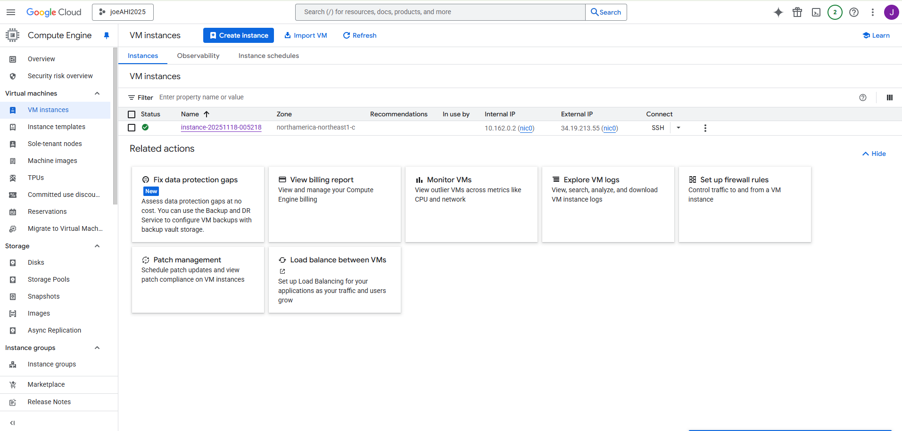
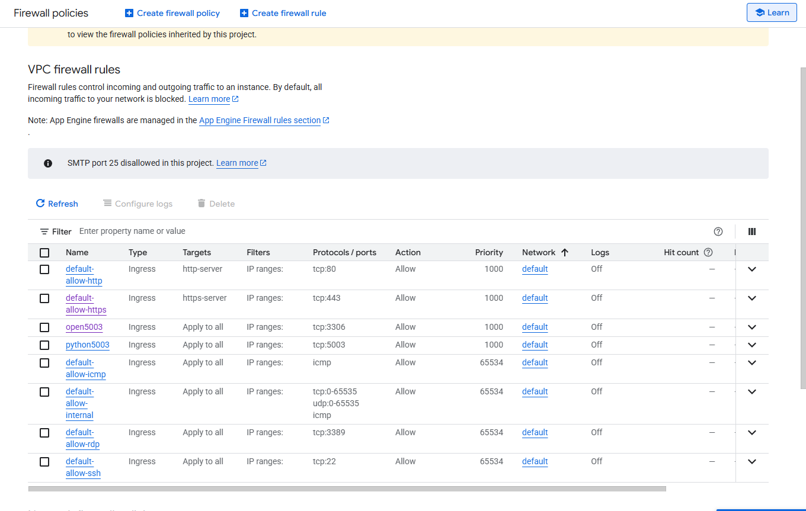
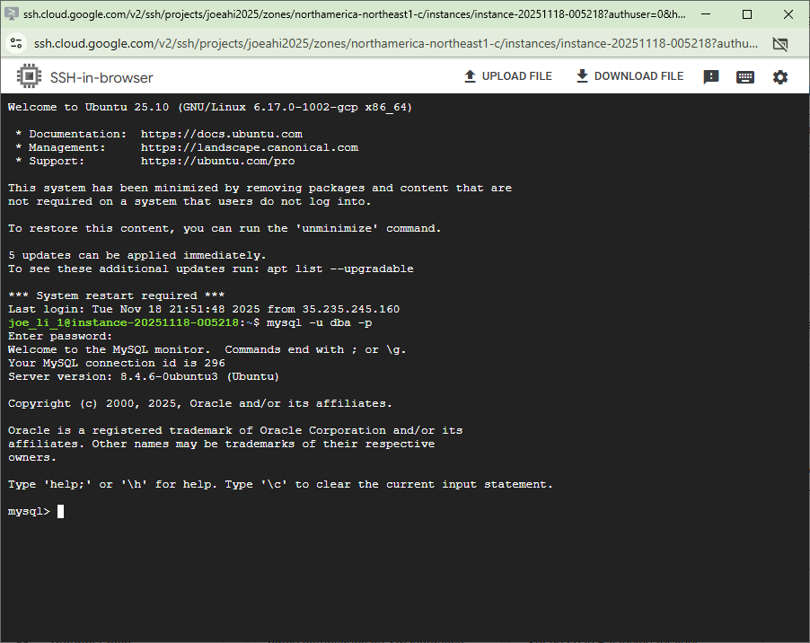
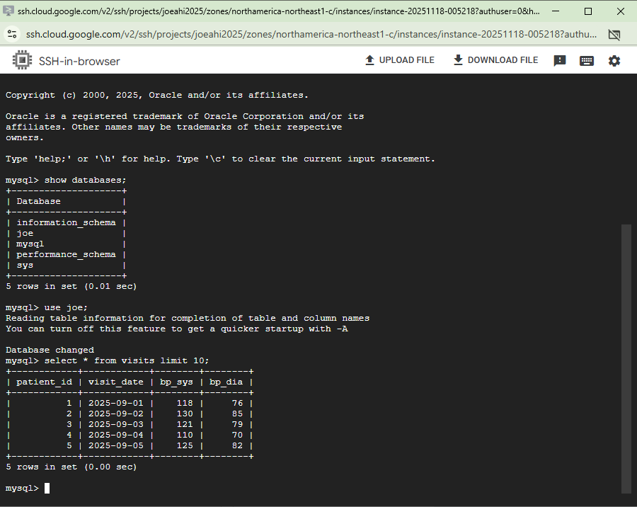

# HHA504_mysql_vm_vs_managed

# MySQl- Comparing VM (self-maged) and Managed

## Recording

## Chosen platform
Google VM and Cloud SQL database

## VM Set Up
### Creating VM
1. Select instance to create
2. Select E2 for affordability
3. Select e2-micro of memory
4. Select Ubuntu OS system
5. Leave everything as default and create

### Firewall Configs
1. Create a firewall rule
2. Name your firewall + description
3. Set IP to 0.0.0.0/0 (allows all IP)
4. Set protocol tcp to '3306'
5. Save and create

### SSH setup
1. Update OS system using `sudo apt-get update`
2. Install mysql using `sudo apt install mysql-server mysql-client`
3. Login to mysql by inputting `sudo mysql`
4. Input `CREATE USER 'xxx'@'%' IDENTIFIED BY 'xxx';` to add user to database
5. Give priviledge to the created user by inputting `GRANT ALL PRIVILEGES ON *.* TO 'xxx'@'%' WITH GRANT OPTION;`
6. Change network connecitons in mysqld.cnf file to `0.0.0.0/0`
7. Restart SSH to save the change
8. Input `mysql -u dba -p` to login

Secrets can be stored in an .env file

## Managed Cloud SQL
### Creating Cloud SQL
1. Create a sandbox MySQL instance
2. Name instance and set a password
3. Select a region and create

### Network Configs
1. Add 0.0.0.0/0 to allow all network
2. Disable SSL only connection
3. Create a new user and set a passowrd

Secrets can be stored in an .env file

## Screenshots
### VM
Running VM

VM Configs

VM Firewall

(Name it incorreclty, but port is still correct)

SSH connection to MySQL

VM Query

### Mangaged SQL
